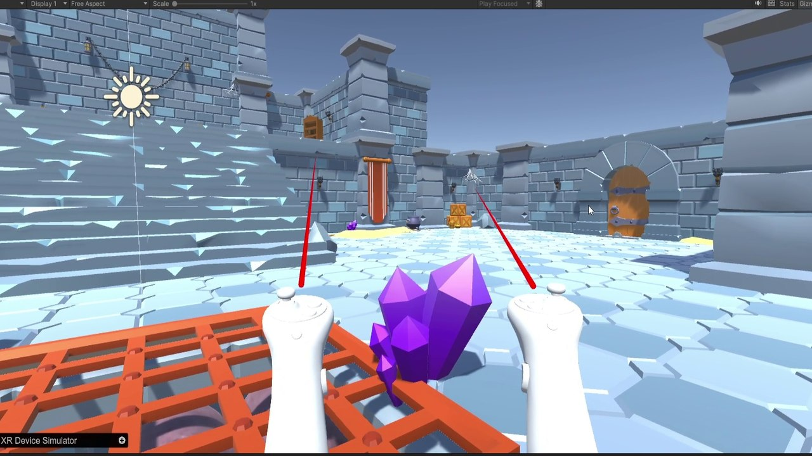

# Realidad virtual con Unity — El castillo del mono

Experiencia de realidad virtual ambientada en una mazmorra medieval gobernada por animales, desarrollada en Unity.

## Qué hace

- Escena explorable con mecánicas de movimiento en VR.
- Integración de modelos y animaciones 3D en el entorno.
- Storyboards y bocetos previos de los personajes.

## Contenido

| Fichero | Qué es |
|---|---|
| `Memoria VR.pdf` | Memoria: entorno, storyboards y recursos utilizados |
| `boceto.png, cerdo.png, mono.png` | Bocetos de los personajes |

> Este repo recoge la memoria y los bocetos; el proyecto de Unity no está incluido.

---

Taller de Realidad Virtual en equipo, 3.º del Grado en Tecnología Digital y Multimedia (UPV). Forma parte de mi [portfolio](https://quique-such.github.io/portafolio/).
